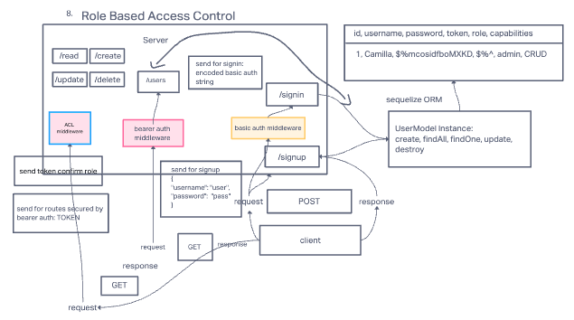

# auth-api

### Author: Camilla Rees
### Version: 1.0.0

### Deployment and Documentation
[Deployed Server on Render](https://auth-api-7kqj.onrender.com/)

## Overview
The goal of this auth-api project is to implement Role Based Access Control (RBAC) using an Access Control List (ACL), allowing to not only restrict access to routes for valid users, but also based on the individual permissions we give each user.

## How it Works

## Key Features
Restrictive Capabilities of our routes to our API:
- Regular users can READ
- Writers can READ and CREATE
- Editors can READ, CREATE, and UPDATE
- Administrators can READ, CREATE, UPDATE, and DELETE

## Architecture

- Sequelize
- Express

## Change Log

[12/7/2022 9:56 PM MDT PR](https://github.com/camillarees/auth-api/pull/1)
[12/7/2022 10:00 PM MDT PR](https://github.com/camillarees/auth-api/pull/2)

## Credit and Collaborations
- [401n49 Starter Code](https://github.com/codefellows/seattle-code-javascript-401d49/tree/main/class-08/lab/starter-code)